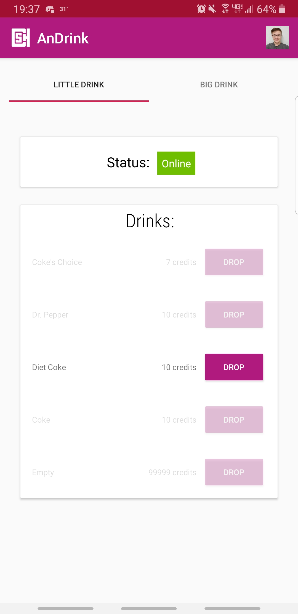
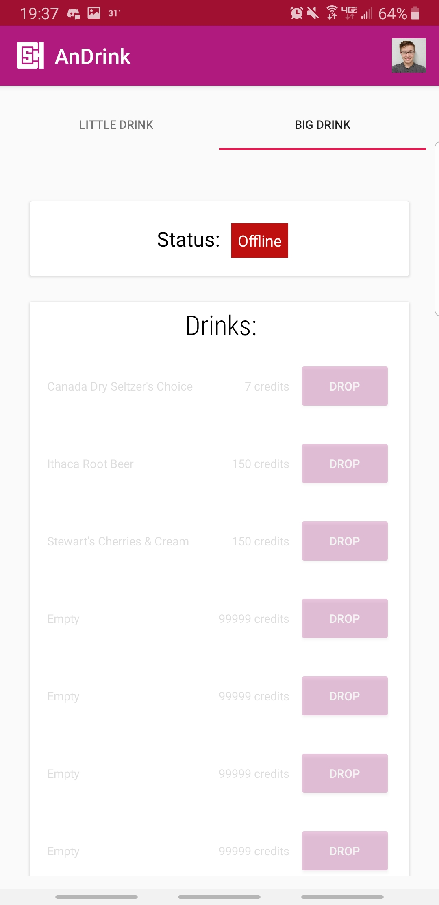
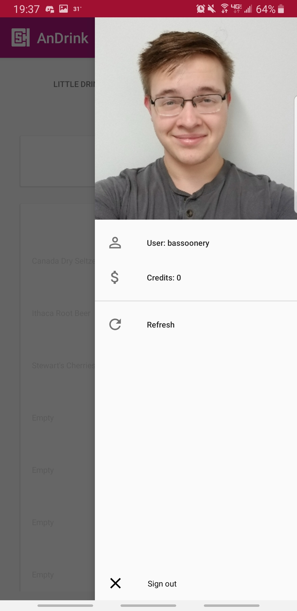

# CSH AnDrink

An Android application client for the [Computer Science House](https://csh.rit.edu/) on-floor drink system which retrieves information from [Mizu](https://github.com/zthart/mizu).

## Overview

AnDrink is an Android application with minimum support for SDK version 16. It is built using the MVVM (Model View Viewmodel) architecture, and uses the [Fuel](https://github.com/kittinunf/fuel/) library for networking. It also uses the Android [Room](https://developer.android.com/jetpack/androidx/releases/room) library for data persistence.

## Related Projects

* [Potion Seller](https://github.com/ramzallan/potion-seller)
* [Tonic](https://github.com/ramzallan/tonic)
* [Mizu](https://github.com/zthart/mizu)

## Features

AnDrink currently supports base functionality for signing in with CSH credentials and purchasing drinks using drink credits.

**Viewing machines**

The contents and statuses of the drink machines are shown on the main page of the application. 
 

**Profile**

The user's profile can be viewed, along with pertinent information (credits) from the sidepanel in the app.

## Planned Features

The following features are planned for further development for the application:

* Admin tools
	* Add/edit items
	* Edit users' drink credits
* Support the Snack machine
* Retrieve drinks faster
